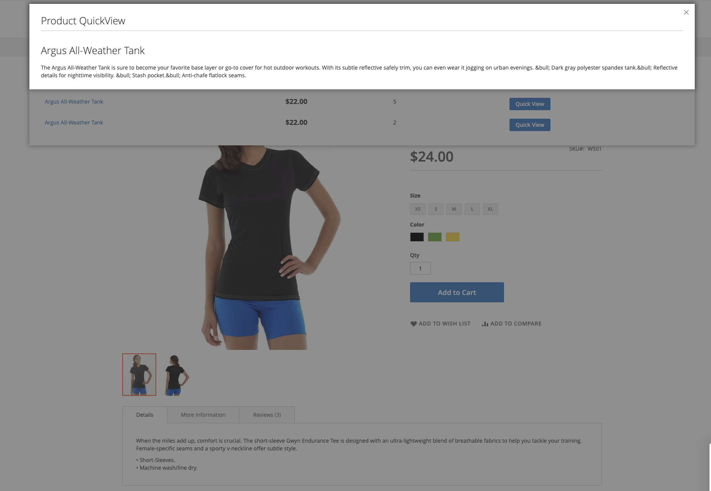

# Quickview Module for Magento 2

This module adds a quick view button to the product list page and product view page.

## Requirements
- Magento 2.4.x
- PHP 7.4.x
## Installation

### Composer

```bash
composer require fr3on/quickview
```

### Manual

Download the module and upload the contents of the module to `app/code/Fr3on/QuickView` directory of your Magento 2 instance.
- Enable the module by running `php bin/magento module:enable Fr3on_QuickView`
- Apply database updates by running `php bin/magento setup:upgrade`
- Flush the cache by running `php bin/magento cache:flush`
- Done

## Screenshots
- 
- 
- 
- 
- 
- 
